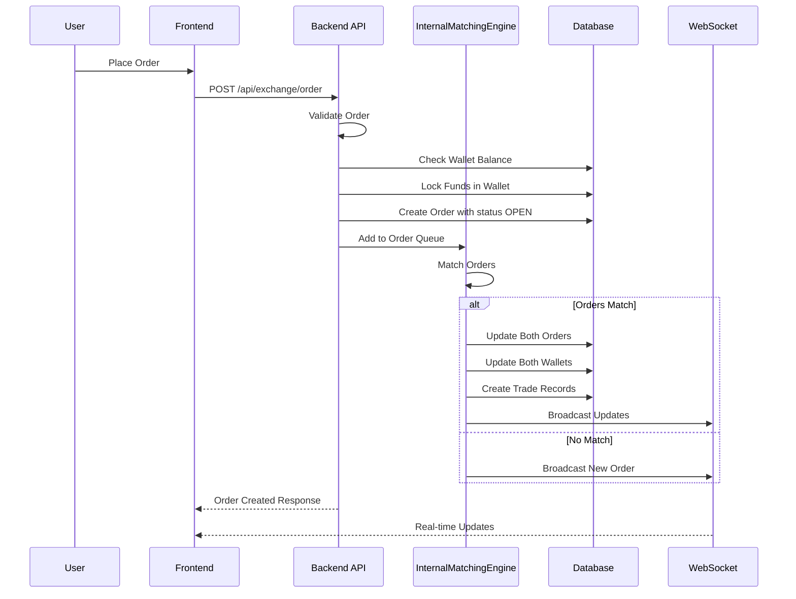

# Internal Exchange Order System Architecture

## Executive Summary

This document outlines the architecture for transforming the current exchange system from an external API-dependent model (Binance, etc.) to a fully internal/simulated exchange system. The goal is to:

- **Keep**: Price data fetching from external APIs for display purposes
- **Replace**: Order creation, execution, and trade matching with internal logic
- **Add**: Admin approval workflow for withdrawals

---

## 1. Current Architecture Analysis

### 1.1 External API Call Locations

The following files currently make external API calls for order/trade operations:

| File | Function | External Call | Action Required |
|------|----------|---------------|-----------------|
| `backend/api/exchange/order/index.post.ts` | Order creation | `exchange.createOrder()` (line 219-245) | Replace with internal matching |
| `backend/api/exchange/order/[id]/index.del.ts` | Order cancellation | `exchange.cancelOrder()` (line 132) | Replace with internal cancellation |
| `backend/api/exchange/order/[id]/index.del.ts` | Fetch order status | `exchange.fetchOrder()` (line 98) | Remove - use DB only |
| `backend/utils/exchange.ts` | Exchange initialization | CCXT library connection | Keep for price data only |
| `backend/api/finance/withdraw/spot/index.post.ts` | Withdrawal execution | `exchange.withdraw()` (lines 253-374) | Replace with admin approval |

### 1.2 Current Order Flow


### 1.3 Key Database Models

#### exchange_order Table
```typescript
interface exchangeOrderAttributes {
  id: string;
  referenceId?: string;        // External exchange order ID - will be null for internal
  userId: string;
  status: 'OPEN' | 'CLOSED' | 'CANCELED' | 'EXPIRED' | 'REJECTED';
  symbol: string;              // e.g., 'BTC/USDT'
  type: 'MARKET' | 'LIMIT';
  timeInForce: 'GTC' | 'IOC' | 'FOK' | 'PO';
  side: 'BUY' | 'SELL';
  price: number;
  average?: number;
  amount: number;
  filled: number;
  remaining: number;
  cost: number;
  trades?: string;             // JSON array of trade details
  fee: number;
  feeCurrency: string;
}
```

#### wallet Table
```typescript
interface walletAttributes {
  id: string;
  userId: string;
  type: 'FIAT' | 'SPOT' | 'ECO' | 'FUTURES' | 'FOREX' | 'STOCK' | 'INDEX';
  currency: string;
  balance: number;
  inOrder?: number;            // Amount locked in open orders
  status: boolean;
}
```

#### transaction Table
```typescript
interface transactionAttributes {
  id: string;
  userId: string;
  walletId: string;
  type: 'WITHDRAW' | 'DEPOSIT' | /* ... other types */;
  status: 'PENDING' | 'COMPLETED' | 'FAILED' | 'CANCELLED' | 'REJECTED' | /* ... */;
  amount: number;
  fee?: number;
  metadata?: any;
  referenceId?: string;
}
```

---

## 2. Proposed Internal Exchange Architecture

### 2.1 High-Level Architecture


### 2.2 New Order Flow (Internal)



---

## 3. Files to Modify

### 3.1 Backend API Files

| File | Changes Required |
|------|------------------|
| `backend/api/exchange/order/index.post.ts` | Remove CCXT calls, implement internal order creation and matching |
| `backend/api/exchange/order/[id]/index.del.ts` | Remove CCXT calls, implement internal cancellation |
| `backend/api/exchange/order/utils.ts` | Update order data handling for internal system |
| `backend/api/exchange/order/index.ws.ts` | Keep - already handles WebSocket broadcasting |
| `backend/api/finance/withdraw/spot/index.post.ts` | Remove auto-execution, always require admin approval |

### 3.2 New Files to Create

| File | Purpose |
|------|---------|
| `backend/utils/spot/matchingEngine.ts` | Internal matching engine for SPOT orders |
| `backend/utils/spot/orderbook.ts` | Internal orderbook management |
| `backend/utils/spot/matchmaking.ts` | Order matching algorithm |

### 3.3 Frontend Files (No Changes Required)

The frontend stores already use generic API calls that will work with the new internal system:
- `src/stores/trade/order/index.ts` - Uses `/api/exchange/order` endpoints
- `src/stores/trade/market/index.ts` - Uses `/api/exchange/market` endpoints

---

## 4. Internal Order Matching Logic

### 4.1 Matching Algorithm

The matching engine will use **Price-Time Priority**:

1. **Price Priority**: Best price orders match first
   - BUY orders: Highest price has priority
   - SELL orders: Lowest price has priority

2. **Time Priority**: For same price, earlier orders match first

### 4.2 Matching Engine Implementation

```typescript
// Pseudocode for matching algorithm
interface Order {
  id: string;
  userId: string;
  symbol: string;
  side: 'BUY' | 'SELL';
  type: 'MARKET' | 'LIMIT';
  price: number;
  amount: number;
  remaining: number;
  filled: number;
  status: 'OPEN' | 'CLOSED' | 'CANCELED';
  createdAt: Date;
}

class SpotMatchingEngine {
  private orderQueues: Map<string, { bids: Order[], asks: Order[] }>;

  async addOrder(order: Order): Promise<void> {
    // 1. Validate order
    // 2. Lock funds in wallet
    // 3. Add to order queue
    // 4. Attempt matching
    // 5. Broadcast updates
  }

  async matchOrders(symbol: string): Promise<void> {
    const { bids, asks } = this.orderQueues.get(symbol);
    
    // Sort bids by price DESC, then by time ASC
    bids.sort((a, b) => b.price - a.price || a.createdAt - b.createdAt);
    
    // Sort asks by price ASC, then by time ASC
    asks.sort((a, b) => a.price - b.price || a.createdAt - b.createdAt);

    while (bids.length > 0 && asks.length > 0) {
      const bestBid = bids[0];
      const bestAsk = asks[0];

      // Check if orders can match
      if (bestBid.price >= bestAsk.price) {
        await this.executeTrade(bestBid, bestAsk);
      } else {
        break; // No more matches possible
      }
    }
  }

  async executeTrade(buyOrder: Order, sellOrder: Order): Promise<void> {
    // Determine fill amount
    const fillAmount = Math.min(buyOrder.remaining, sellOrder.remaining);
    const fillPrice = sellOrder.price; // Use maker price

    // Update orders
    buyOrder.filled += fillAmount;
    buyOrder.remaining -= fillAmount;
    sellOrder.filled += fillAmount;
    sellOrder.remaining -= fillAmount;

    // Update statuses
    if (buyOrder.remaining === 0) buyOrder.status = 'CLOSED';
    if (sellOrder.remaining === 0) sellOrder.status = 'CLOSED';

    // Update wallets
    // Buyer receives: fillAmount of base currency
    // Seller receives: fillAmount * fillPrice of quote currency

    // Record trade
    // Broadcast updates
  }
}
```

### 4.3 Partial Fill Handling

```mermaid
flowchart LR
    subgraph Order A - BUY 10 BTC @ 50000
        A1[Amount: 10]
        A2[Filled: 0]
        A3[Remaining: 10]
    end

    subgraph Order B - SELL 3 BTC @ 50000
        B1[Amount: 3]
        B2[Filled: 0]
        B3[Remaining: 3]
    end

    subgraph After Match
        A4[Order A: Filled 3, Remaining 7, Status OPEN]
        B4[Order B: Filled 3, Remaining 0, Status CLOSED]
    end

    A1 --> A4
    B1 --> B4
```

---

## 5. Admin Withdrawal Approval Workflow

### 5.1 Current Withdrawal Flow

The system already has a `withdrawApproval` setting that controls whether withdrawals need admin approval. When enabled:

1. User submits withdrawal request
2. Transaction created with status `PENDING`
3. Admin reviews in admin panel
4. Admin approves or rejects

### 5.2 Proposed Changes

For the internal exchange, **all withdrawals should require admin approval** regardless of the setting:


### 5.3 Admin Endpoints (Already Exist)

| Endpoint | File | Purpose |
|----------|------|---------|
| `POST /api/admin/finance/wallet/:id/withdraw/approve` | `backend/api/admin/finance/wallet/[id]/withdraw/approve.post.ts` | Approve withdrawal |
| `POST /api/admin/finance/wallet/:id/withdraw/reject` | `backend/api/admin/finance/wallet/[id]/withdraw/reject.post.ts` | Reject withdrawal |

### 5.4 Required Modifications

1. **Remove external exchange withdrawal calls** from `approve.post.ts`
2. **Always set withdrawals to PENDING** in `backend/api/finance/withdraw/spot/index.post.ts`
3. **Add admin notification** when new withdrawal is submitted

---

## 6. Database Schema Changes

### 6.1 No New Tables Required

The existing schema supports internal trading:
- `exchange_order` - Already has all required fields
- `wallet` - Has `inOrder` field for locked funds
- `transaction` - Supports all transaction types

### 6.2 Recommended Index Additions

```sql
-- For faster order matching queries
CREATE INDEX idx_exchange_order_symbol_status_side 
ON exchange_order (symbol, status, side, price, createdAt);

-- For faster open order lookups
CREATE INDEX idx_exchange_order_user_status 
ON exchange_order (userId, status);
```

### 6.3 Migration Considerations

For existing orders with `referenceId` pointing to external exchanges:
1. Mark all existing OPEN orders as CANCELED
2. Refund locked funds to user wallets
3. Clear `referenceId` field for new internal orders

---

## 7. Price Data Flow (Keep External)

### 7.1 What Stays External

| Feature | Source | Purpose |
|---------|--------|---------|
| Ticker prices | Binance API | Display current market prices |
| Orderbook depth | Binance API | Display market depth chart |
| Historical candles | Binance API | Display price charts |

### 7.2 Price Data Architecture


### 7.3 Files That Should NOT Be Modified

| File | Purpose |
|------|---------|
| `backend/api/exchange/ticker/*` | Price ticker endpoints |
| `backend/api/exchange/chart/*` | Chart data endpoints |
| `backend/api/exchange/orderbook/*` | External orderbook display |
| `backend/api/exchange/market/*` | Market listing endpoints |

---

## 8. Testing Strategy

### 8.1 Unit Tests for Matching Engine

```typescript
describe('SpotMatchingEngine', () => {
  describe('Order Matching', () => {
    it('should match buy and sell orders at same price');
    it('should match buy order with lower sell order');
    it('should not match buy order with higher sell order');
    it('should handle partial fills correctly');
    it('should respect price-time priority');
  });

  describe('Wallet Updates', () => {
    it('should lock funds when order is placed');
    it('should release funds when order is canceled');
    it('should transfer funds when trade executes');
    it('should handle fees correctly');
  });

  describe('Market Orders', () => {
    it('should execute market buy at best ask price');
    it('should execute market sell at best bid price');
    it('should fail market order if no liquidity');
  });
});
```

### 8.2 Integration Tests

```typescript
describe('Order Flow Integration', () => {
  it('should create order and update wallet balance');
  it('should match two orders and update both wallets');
  it('should broadcast order updates via WebSocket');
  it('should handle concurrent order submissions');
});
```

### 8.3 Manual Testing Checklist

- [ ] Place limit buy order - verify wallet locked
- [ ] Place limit sell order - verify wallet locked
- [ ] Place matching orders - verify trade execution
- [ ] Cancel open order - verify funds returned
- [ ] Place market order - verify immediate execution
- [ ] Submit withdrawal - verify pending status
- [ ] Admin approve withdrawal - verify balance deducted
- [ ] Admin reject withdrawal - verify balance unchanged

---

## 9. Security Considerations

### 9.1 Order Manipulation Prevention

1. **Balance Validation**: Always verify wallet balance before order creation
2. **Atomic Transactions**: Use database transactions for all order operations
3. **Order Locking**: Prevent concurrent modifications to same order
4. **Rate Limiting**: Limit order submissions per user

### 9.2 Withdrawal Security

1. **Admin-Only Approval**: No automatic withdrawals
2. **Audit Logging**: Log all withdrawal approvals/rejections
3. **Two-Factor**: Consider requiring 2FA for admin actions
4. **Amount Limits**: Implement daily/weekly withdrawal limits

---

## 10. Implementation Plan

### Phase 1: Core Matching Engine
1. Create `backend/utils/spot/matchingEngine.ts`
2. Create `backend/utils/spot/orderbook.ts`
3. Create `backend/utils/spot/matchmaking.ts`
4. Add unit tests for matching logic

### Phase 2: Order API Modifications
1. Modify `backend/api/exchange/order/index.post.ts` to use internal matching
2. Modify `backend/api/exchange/order/[id]/index.del.ts` for internal cancellation
3. Update WebSocket broadcasting for internal orders

### Phase 3: Withdrawal Flow
1. Modify `backend/api/finance/withdraw/spot/index.post.ts` to always require approval
2. Update admin approval endpoint to not call external APIs
3. Add admin notification for new withdrawals

### Phase 4: Migration & Testing
1. Create migration script for existing orders
2. Run integration tests
3. Perform manual testing
4. Deploy to staging environment

### Phase 5: Production Deployment
1. Backup existing data
2. Run migration
3. Deploy new code
4. Monitor for issues

---

## 11. Reference: Existing ECO Matching Engine

The project already has a matching engine for ECO (ecosystem) tokens at:
- `backend/utils/eco/matchingEngine.ts`
- `backend/utils/eco/matchmaking.ts`
- `backend/utils/eco/orderbook.ts`

Key patterns to reuse:
- Order queue management
- Price-time priority sorting
- Wallet balance updates
- WebSocket broadcasting
- Candle/ticker updates

The ECO matching engine uses ScyllaDB for high-performance storage. For SPOT trading, we can use the existing MySQL/PostgreSQL database with proper indexing.

---

## 12. Summary

### What Changes
| Component | Current | Proposed |
|-----------|---------|----------|
| Order Creation | External API (Binance) | Internal Database |
| Order Matching | External Exchange | Internal Matching Engine |
| Trade Execution | External Exchange | Internal Wallet Updates |
| Order Cancellation | External API | Internal Database |
| Withdrawals | Auto-execute or Admin | Always Admin Approval |

### What Stays the Same
| Component | Source |
|-----------|--------|
| Price Tickers | External API (Binance) |
| Orderbook Display | External API (Binance) |
| Chart Data | External API (Binance) |
| Market Listings | Database (exchange_market) |
| Frontend UI | No changes needed |

---

## Appendix A: File Reference

### Files to Modify
```
backend/api/exchange/order/index.post.ts
backend/api/exchange/order/[id]/index.del.ts
backend/api/exchange/order/utils.ts
backend/api/finance/withdraw/spot/index.post.ts
backend/api/admin/finance/wallet/[id]/withdraw/approve.post.ts
```

### Files to Create
```
backend/utils/spot/matchingEngine.ts
backend/utils/spot/orderbook.ts
backend/utils/spot/matchmaking.ts
backend/utils/spot/types.ts
```

### Files to Keep Unchanged
```
backend/api/exchange/ticker/*
backend/api/exchange/chart/*
backend/api/exchange/market/*
backend/api/exchange/orderbook/*
backend/utils/exchange.ts (keep for price data)
src/stores/trade/* (frontend works as-is)