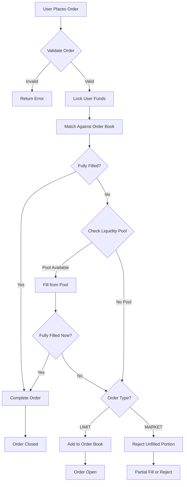
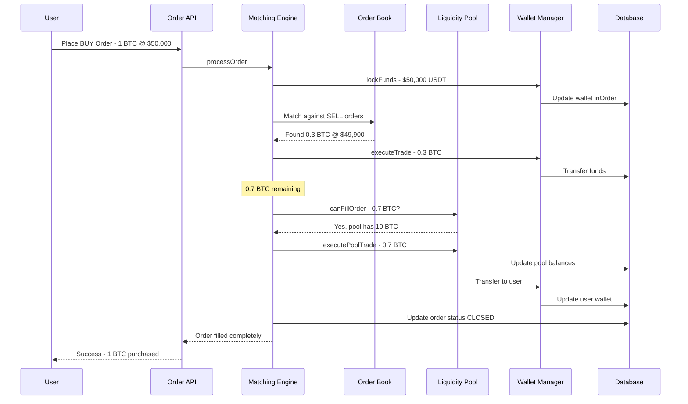

# Admin Liquidity Pool Management System - Design Document

> **Status**: ✅ IMPLEMENTED

## Overview

This document outlines the design for an Admin Liquidity Pool Management System that enables administrators to provide liquidity for the internal SPOT exchange. The system allows the platform to act as a market maker, ensuring users can execute trades even when there are no other users on the opposite side of the order book.

## Current Architecture Summary

### Existing Components

1. **SpotMatchingEngine** ([`backend/utils/spot/matchingEngine.ts`](backend/utils/spot/matchingEngine.ts))
   - Price-time priority matching algorithm
   - In-memory order book with bids/asks Maps
   - Supports LIMIT and MARKET orders
   - Throws `NoLiquidityError` when MARKET orders have no counterparty

2. **SpotWalletManager** ([`backend/utils/spot/walletManager.ts`](backend/utils/spot/walletManager.ts))
   - Lock/release funds for orders
   - Execute trades between users
   - Records admin profit from fees

3. **Order Creation API** ([`backend/api/exchange/order/index.post.ts`](backend/api/exchange/order/index.post.ts))
   - Validates orders against market metadata
   - Uses internal matching engine when initialized

4. **Database Models**
   - [`exchangeOrder`](models/exchangeOrder.ts) - Order records
   - [`exchangeMarket`](models/exchangeMarket.ts) - Trading pairs with metadata
   - [`wallet`](models/wallet.ts) - User wallets with balance and inOrder fields

---

## Proposed Solution

### Concept: Admin Liquidity Pool

The Admin Liquidity Pool is a special system-owned pool of funds that can automatically fill user orders when no other users are available on the opposite side. This acts as a house market maker.

### Key Design Decisions

1. **Dedicated Liquidity Pool Table** - Store liquidity configuration per trading pair
2. **System User for Pool** - Use a dedicated system user ID for pool wallets
3. **Automatic Order Matching** - Integrate pool liquidity into the matching engine
4. **Admin UI** - Provide interface for managing pool liquidity

---

## 1. Database Schema Changes

### New Table: `liquidity_pool`

```sql
CREATE TABLE liquidity_pool (
  id UUID PRIMARY KEY DEFAULT uuid_generate_v4(),
  symbol VARCHAR(191) NOT NULL UNIQUE,        -- e.g., BTC/USDT
  currency VARCHAR(191) NOT NULL,             -- Base currency, e.g., BTC
  pair VARCHAR(191) NOT NULL,                 -- Quote currency, e.g., USDT
  base_balance DOUBLE NOT NULL DEFAULT 0,     -- Available base currency
  quote_balance DOUBLE NOT NULL DEFAULT 0,    -- Available quote currency
  base_in_order DOUBLE NOT NULL DEFAULT 0,    -- Base currency locked in orders
  quote_in_order DOUBLE NOT NULL DEFAULT 0,   -- Quote currency locked in orders
  spread_percentage DOUBLE DEFAULT 0.1,       -- Spread from market price
  min_order_size DOUBLE DEFAULT 0,            -- Minimum order size to fill
  max_order_size DOUBLE DEFAULT 0,            -- Maximum order size to fill, 0 = unlimited
  is_active BOOLEAN NOT NULL DEFAULT true,    -- Enable/disable pool for this pair
  created_at TIMESTAMP DEFAULT CURRENT_TIMESTAMP,
  updated_at TIMESTAMP DEFAULT CURRENT_TIMESTAMP
);

CREATE INDEX idx_liquidity_pool_symbol ON liquidity_pool(symbol);
CREATE INDEX idx_liquidity_pool_active ON liquidity_pool(is_active);
```

### New Table: `liquidity_pool_transaction`

```sql
CREATE TABLE liquidity_pool_transaction (
  id UUID PRIMARY KEY DEFAULT uuid_generate_v4(),
  pool_id UUID NOT NULL REFERENCES liquidity_pool(id),
  type VARCHAR(50) NOT NULL,                  -- DEPOSIT, WITHDRAW, TRADE_BUY, TRADE_SELL
  currency VARCHAR(191) NOT NULL,             -- Currency affected
  amount DOUBLE NOT NULL,                     -- Amount changed
  balance_before DOUBLE NOT NULL,             -- Balance before transaction
  balance_after DOUBLE NOT NULL,              -- Balance after transaction
  order_id UUID,                              -- Related order if trade
  user_id UUID,                               -- User involved if trade
  description TEXT,                           -- Human-readable description
  created_at TIMESTAMP DEFAULT CURRENT_TIMESTAMP
);

CREATE INDEX idx_lp_transaction_pool ON liquidity_pool_transaction(pool_id);
CREATE INDEX idx_lp_transaction_type ON liquidity_pool_transaction(type);
CREATE INDEX idx_lp_transaction_created ON liquidity_pool_transaction(created_at);
```

---

## 2. API Endpoints

### Admin Liquidity Pool APIs

| Method | Endpoint | Description |
| ------ | -------- | ----------- |
| GET | `/api/admin/ext/spot/liquidity-pool` | List all liquidity pools |
| GET | `/api/admin/ext/spot/liquidity-pool/[id]` | Get single pool details |
| POST | `/api/admin/ext/spot/liquidity-pool` | Create new liquidity pool |
| PUT | `/api/admin/ext/spot/liquidity-pool/[id]` | Update pool settings |
| DELETE | `/api/admin/ext/spot/liquidity-pool/[id]` | Delete liquidity pool |
| POST | `/api/admin/ext/spot/liquidity-pool/[id]/deposit` | Add liquidity to pool |
| POST | `/api/admin/ext/spot/liquidity-pool/[id]/withdraw` | Remove liquidity from pool |
| PUT | `/api/admin/ext/spot/liquidity-pool/[id]/status` | Toggle pool active status |
| GET | `/api/admin/ext/spot/liquidity-pool/[id]/transactions` | Get pool transaction history |
| GET | `/api/admin/ext/spot/liquidity-pool/structure` | Get data structure for UI |

### API Request/Response Examples

#### Create Liquidity Pool
```typescript
// POST /api/admin/ext/spot/liquidity-pool
{
  symbol: "BTC/USDT",
  spreadPercentage: 0.1,
  minOrderSize: 0.001,
  maxOrderSize: 10,
  isActive: true
}
```

#### Deposit Liquidity
```typescript
// POST /api/admin/ext/spot/liquidity-pool/[id]/deposit
{
  baseAmount: 10,      // 10 BTC
  quoteAmount: 500000  // 500,000 USDT
}
```

---

## 3. Matching Engine Enhancements

### Modified Order Matching Flow



### Key Changes to [`SpotMatchingEngine`](backend/utils/spot/matchingEngine.ts:123)

1. **Add Liquidity Pool Manager Reference**

   ```typescript
   private liquidityPoolManager: LiquidityPoolManager | null = null;
   ```

2. **Modify [`matchBuyOrder`](backend/utils/spot/matchingEngine.ts:446) and [`matchSellOrder`](backend/utils/spot/matchingEngine.ts:516)**
   - After matching against user orders, check if remaining amount can be filled from pool
   - Call pool manager to execute pool trades

3. **New Method: `fillFromLiquidityPool`**

   ```typescript
   private async fillFromLiquidityPool(
     order: Order,
     remainingAmount: number
   ): Promise<{ filled: number; trades: Trade[] }>
   ```

---

## 4. New Backend Components

### LiquidityPoolManager Class

Location: `backend/utils/spot/liquidityPoolManager.ts`

```typescript
export class LiquidityPoolManager {
  private static instance: LiquidityPoolManager | null = null;
  private pools: Map<string, LiquidityPool>;

  // Singleton pattern
  static getInstance(): LiquidityPoolManager;

  // Initialize and load pools from database
  async initialize(): Promise<void>;

  // Check if pool can fill an order
  canFillOrder(symbol: string, side: OrderSide, amount: number, price: number): boolean;

  // Execute a trade against the pool
  async executePoolTrade(
    userId: string,
    symbol: string,
    side: OrderSide,
    amount: number,
    price: number,
    transaction?: Transaction
  ): Promise<PoolTradeResult>;

  // Admin operations
  async createPool(data: CreatePoolInput): Promise<LiquidityPool>;
  async updatePool(id: string, data: UpdatePoolInput): Promise<LiquidityPool>;
  async depositLiquidity(id: string, baseAmount: number, quoteAmount: number): Promise<void>;
  async withdrawLiquidity(id: string, baseAmount: number, quoteAmount: number): Promise<void>;
  async getPoolStats(id: string): Promise<PoolStats>;
}
```

### Pool Trade Execution Logic

When a user order needs to be filled from the pool:

1. **For BUY orders** - User buys base currency, pool sells base currency
   - Pool: Decrease `base_balance`, Increase `quote_balance`
   - User: Increase base wallet, Decrease quote wallet

2. **For SELL orders** - User sells base currency, pool buys base currency
   - Pool: Increase `base_balance`, Decrease `quote_balance`
   - User: Decrease base wallet, Increase quote wallet

---

## 5. Admin UI Components

### Page Structure

Location: `src/pages/admin/ext/spot/liquidity-pool/`

```text
liquidity-pool/
├── index.tsx           # List all pools with stats
├── [id]/
│   ├── index.tsx       # Pool detail view
│   └── transactions.tsx # Transaction history
```

### Main Dashboard View

```text
┌─────────────────────────────────────────────────────────────────────┐
│  Liquidity Pool Management                              [+ Add Pool] │
├─────────────────────────────────────────────────────────────────────┤
│                                                                      │
│  ┌─────────────────────────────────────────────────────────────────┐│
│  │ Symbol    │ Base Balance │ Quote Balance │ Status │ Actions     ││
│  ├───────────┼──────────────┼───────────────┼────────┼─────────────┤│
│  │ BTC/USDT  │ 10.5 BTC     │ 525,000 USDT  │ Active │ [Edit][Dep] ││
│  │ ETH/USDT  │ 150 ETH      │ 300,000 USDT  │ Active │ [Edit][Dep] ││
│  │ SOL/USDT  │ 0 SOL        │ 0 USDT        │ Paused │ [Edit][Dep] ││
│  └─────────────────────────────────────────────────────────────────┘│
│                                                                      │
│  Pool Statistics                                                     │
│  ┌──────────────┐ ┌──────────────┐ ┌──────────────┐                 │
│  │ Total Value  │ │ 24h Volume   │ │ Active Pools │                 │
│  │ $1,250,000   │ │ $45,230      │ │ 2/3          │                 │
│  └──────────────┘ └──────────────┘ └──────────────┘                 │
└─────────────────────────────────────────────────────────────────────┘
```

### Pool Detail View

```text
┌─────────────────────────────────────────────────────────────────────┐
│  BTC/USDT Liquidity Pool                    [Deposit] [Withdraw]    │
├─────────────────────────────────────────────────────────────────────┤
│                                                                      │
│  Balances                                                            │
│  ┌─────────────────────────┐  ┌─────────────────────────┐           │
│  │ BTC Balance             │  │ USDT Balance            │           │
│  │ Available: 10.5 BTC     │  │ Available: 525,000 USDT │           │
│  │ In Orders: 0.5 BTC      │  │ In Orders: 25,000 USDT  │           │
│  │ Total: 11.0 BTC         │  │ Total: 550,000 USDT     │           │
│  └─────────────────────────┘  └─────────────────────────┘           │
│                                                                      │
│  Settings                                                            │
│  ┌─────────────────────────────────────────────────────────────────┐│
│  │ Spread: 0.1%  │ Min Order: 0.001 BTC │ Max Order: 10 BTC        ││
│  │ Status: [x] Active                                               ││
│  └─────────────────────────────────────────────────────────────────┘│
│                                                                      │
│  Recent Transactions                                                 │
│  ┌─────────────────────────────────────────────────────────────────┐│
│  │ Time       │ Type      │ Amount      │ User      │ Order        ││
│  ├────────────┼───────────┼─────────────┼───────────┼──────────────┤│
│  │ 10:30:15   │ TRADE_BUY │ +0.5 BTC    │ user123   │ ord-abc-123  ││
│  │ 10:28:42   │ TRADE_SELL│ -0.3 BTC    │ user456   │ ord-def-456  ││
│  │ 09:00:00   │ DEPOSIT   │ +5.0 BTC    │ admin     │ -            ││
│  └─────────────────────────────────────────────────────────────────┘│
└─────────────────────────────────────────────────────────────────────┘
```

---

## 6. Order Matching Flow Diagram



---

## 7. Implementation Todo List

### Phase 1: Database & Models

- [ ] Create migration for `liquidity_pool` table
- [ ] Create migration for `liquidity_pool_transaction` table
- [ ] Create Sequelize model for `liquidityPool`
- [ ] Create Sequelize model for `liquidityPoolTransaction`
- [ ] Register models in [`models/init.ts`](models/init.ts)

### Phase 2: Backend Core

- [ ] Create `LiquidityPoolManager` class in `backend/utils/spot/liquidityPoolManager.ts`
- [ ] Implement pool CRUD operations
- [ ] Implement deposit/withdraw liquidity methods
- [ ] Implement `canFillOrder` check method
- [ ] Implement `executePoolTrade` method
- [ ] Add pool manager to SPOT engine initialization

### Phase 3: Matching Engine Integration

- [ ] Add `liquidityPoolManager` reference to `SpotMatchingEngine`
- [ ] Modify `matchBuyOrder` to check pool after order book
- [ ] Modify `matchSellOrder` to check pool after order book
- [ ] Add `fillFromLiquidityPool` private method
- [ ] Update `checkLiquidity` to include pool availability
- [ ] Add pool trade recording to transaction history

### Phase 4: Admin API Endpoints

- [ ] Create `backend/api/admin/ext/spot/liquidity-pool/index.get.ts` - List pools
- [ ] Create `backend/api/admin/ext/spot/liquidity-pool/index.post.ts` - Create pool
- [ ] Create `backend/api/admin/ext/spot/liquidity-pool/structure.get.ts` - UI structure
- [ ] Create `backend/api/admin/ext/spot/liquidity-pool/[id]/index.get.ts` - Get pool
- [ ] Create `backend/api/admin/ext/spot/liquidity-pool/[id]/index.put.ts` - Update pool
- [ ] Create `backend/api/admin/ext/spot/liquidity-pool/[id]/index.del.ts` - Delete pool
- [ ] Create `backend/api/admin/ext/spot/liquidity-pool/[id]/deposit.post.ts` - Deposit
- [ ] Create `backend/api/admin/ext/spot/liquidity-pool/[id]/withdraw.post.ts` - Withdraw
- [ ] Create `backend/api/admin/ext/spot/liquidity-pool/[id]/status.put.ts` - Toggle status
- [ ] Create `backend/api/admin/ext/spot/liquidity-pool/[id]/transactions.get.ts` - History

### Phase 5: Admin UI

- [ ] Create `src/pages/admin/ext/spot/liquidity-pool/index.tsx` - Pool list page
- [ ] Create pool creation modal component
- [ ] Create pool edit modal component
- [ ] Create deposit/withdraw modal component
- [ ] Create `src/pages/admin/ext/spot/liquidity-pool/[id]/index.tsx` - Pool detail
- [ ] Create transaction history table component
- [ ] Add navigation menu item for liquidity pools

### Phase 6: Testing & Documentation

- [ ] Test pool creation and configuration
- [ ] Test deposit and withdrawal operations
- [ ] Test order matching with pool liquidity
- [ ] Test edge cases - insufficient pool balance, disabled pools
- [ ] Update API documentation
- [ ] Create admin user guide

---

## 8. Security Considerations

1. **Admin-Only Access** - All pool management endpoints require admin authentication
2. **Transaction Atomicity** - All pool trades use database transactions
3. **Balance Validation** - Prevent negative balances in pools
4. **Audit Trail** - All pool operations logged in `liquidity_pool_transaction`
5. **Rate Limiting** - Consider rate limits on pool operations

---

## 9. Future Enhancements

1. **Dynamic Pricing** - Adjust pool prices based on external market data
2. **Auto-Rebalancing** - Automatically rebalance pool when ratios skew
3. **Multiple Price Levels** - Support tiered pricing for large orders
4. **Pool Analytics** - Detailed P&L tracking and reporting
5. **API for External Market Makers** - Allow third-party liquidity providers